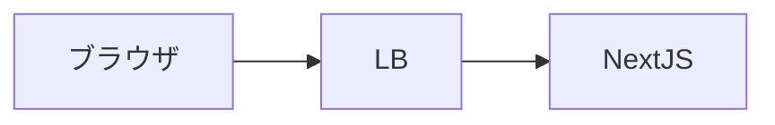
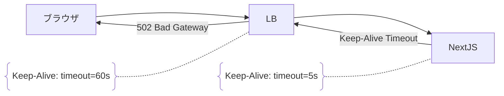

# 事象: しばしば 502 Bad Gateway が発生する


NextJS のアプリケーションを開発中にしばしば 502 Bad Gateway が発生していました。
アーキテクチャの構成は ブラウザ -> LB -> NextJS のような形になっていて、LB の背後に NextJS が動いています。



# 原因: Keep-Alive タイムアウト

NextJS は NodeJS で動いているので、NodeJS の Keep-Alive タイムアウトが 5 秒に設定されています。
LB の Keep-Alive タイムアウトは 60 秒に設定されているので、LB が Keep-Alive を維持している間に NextJS の Keep-Alive タイムアウトが切れてしまい、502 Bad Gateway が想定よりも早く発生していました。
NextJS で Keep-Alive がタイムアウトしてしまうとアプリケーション側（NextJS 側）ではハンドリングができなくなってしまうので、LB 側で 502 Bad Gateway をブラウザに返す挙動になります。



# 解決策: Keep-Alive タイムアウトを伸ばす

NextJS の Keep-Alive タイムアウトを伸ばすことで解決できることがあります。

- LB: Keep-Alive タイムアウト 60 秒（ここは特に変更しない）
- NextJS: Keep-Alive タイムアウト を 5 秒 から 61 秒に変更、Header タイムアウトを 62 秒に設定

### 📌 ポイント

- NextJS のタイムアウトは LB の Keep-Alive タイムアウトよりも少し長くする
  - NodeJS のソケット接続が少なくとも LB と同じ時間以上維持され、LB 側が早すぎる切断で 502 を返すことは避けられます。
- Header タイムアウトは Keep-Alive タイムアウトよりも長くする
  - ヘッダー受信の待機時間を Keep-Alive よりも少し長くすることで「ヘッダー受信に失敗した」というエラーを回避できます。

### 実装サンプル

NextJS でカスタムサーバーを使っている場合は、以下のように `server.keepAliveTimeout` を設定することで Keep-Alive タイムアウトを変更できます。

```javascript
const express = require('express');
const app = express();

// ... (ミドルウェアやルートの設定) ...

const port = 3000;
const server = app.listen(port, () => {
  console.log(`Express server listening on port ${port}`);

  // keepAliveTimeout の値を確認 (ミリ秒単位)
  const keepAliveTimeout = server.keepAliveTimeout;
  console.log(`Express server keepAliveTimeout: ${keepAliveTimeout} ms`);

  // headersTimeout の値も関連情報として確認できます
  const headersTimeout = server.headersTimeout;
  console.log(`Express server headersTimeout: ${headersTimeout} ms`);
});

server.keepAliveTimeout = 61000; // 61秒
server.headersTimeout = 62000; // 62秒 (keepAliveTimeout より少し長くするのが一般的)
```

# まとめ

NextJS に限った話ではないですが正しく Keep-Alive を設定しないと、予期せぬタイムアウトが発生することがある、という話でした。

# 参考ページ

https://developer.mozilla.org/ja/docs/Web/HTTP/Reference/Headers/Keep-Alive

https://github.com/vercel/next.js/discussions/22211

https://github.com/vercel/vercel/issues/11692

https://github.com/expressjs/timeout

https://expressjs.com/en/resources/middleware/timeout.html#as-top-level-middleware

https://zenn.dev/forcia_tech/articles/202305_http_keepalive
