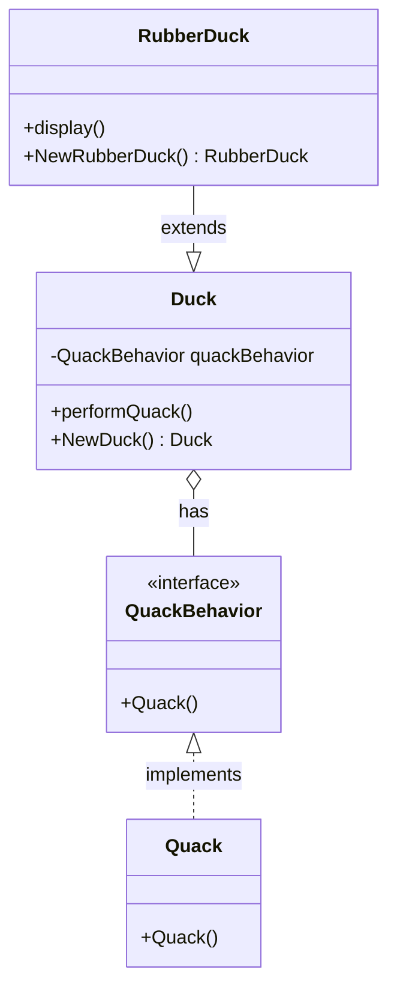

# はじめてGoプログラミング言語を触った感想


画像: https://go.dev/blog/gopher

## はじめに

Go 暦は 1ヶ月です。勉強のためにちょっとした REST API を Go で書いてみたのでそのときの感想を書きます。

## Go とは

[Go](https://go.dev/) はコンパイル、同時実行、ガベージコレクションが行われる静的型付け言語です。開発元は Google です。Google の巨大なコードベースと頻繁なアップデートがコンパイルとビルド時間を必要としていたため、Go はこれらの課題を解決することを目的に開発されました。（[参考](https://go.dev/talks/2012/splash.article)）

- 2009年11月に最初のバージョンをオープンソースで公開
  - 2012年3月に正式バージョン1.0を公開
  - 2023年12月時点の最新バージョンは1.21
  - リリースサイクルは６ヶ月ごと（[参考](https://go.dev/wiki/Go-Release-Cycle)）

## Go の特徴

Go は独自の設計哲学と原則に基づいて設計されています。以下は、Go の主要な哲学とそれに関連する原則や特徴をいくつか紹介します。

### シンプルさと明瞭さ

Go の設計は、言語機能を最小限に抑え、それにより学習曲線を緩やかにし、コードの読みやすさとメンテナンスの容易さを重視しています。これは、例えば class や inheritance のような伝統的なオブジェクト指向の概念が Go に含まれていない理由の一部でもあります。"考えられたシンプルさ" が Go を理解しやすくしています。（[参考](https://go.dev/doc/faq#principles)）

### 標準パッケージ

Goには、ネットワーキング、データ処理、暗号化などの多くのタスクをサポートする強力な標準ライブラリが付属しています。これにより、外部の依存関係を最小限に抑えることができます。

- https://pkg.go.dev/std

| パッケージ名    | 説明                                                           |
| --------------- | -------------------------------------------------------------- |
| `fmt`           | フォーマットI/O（入出力操作）を提供します。                    |
| `net/http`      | HTTPクライアントとサーバーの機能を提供します。                 |
| `os`            | オペレーティングシステム機能へのインターフェースを提供します。 |
| `encoding/json` | JSONのエンコーディングとデコーディングを提供します。           |
| `log`           | ロギング機能を提供します。                                     |

など。

### 一貫したエラーハンドリング

Goでは、例外の代わりにエラー値を返すアプローチが採用されています。これにより、エラーハンドリングが明示的に行われ、コードの流れが読みやすくなります。（[参考](https://go.dev/doc/faq#exceptions)）

### 充実した周辺ツール

Goには、フォーマッティング（gofmt）、依存関係の管理（go mod）、ドキュメンテーションの生成（godoc）など、一貫したツールセットが付属しています。これにより、Goのプロジェクトは統一感のあるコーディングスタイルや構造を持つことができます。

| ツール名          | 用途                                                                                            |
| ----------------- | ----------------------------------------------------------------------------------------------- |
| `go build`        | Goプログラムのコンパイルとバイナリ生成                                                          |
| `go test`         | ユニットテストとベンチマークの実行                                                              |
| `gofmt`, `go fmt` | Goコードのフォーマット調整. `go fmt` は `gofmt` のラッパーで内部で `gofmt -l -w` コマンドを実行 |
| `go vet`          | Goコードの静的解析、潜在的なエラーの探索                                                        |
| `go doc`          | ドキュメンテーションの閲覧と生成                                                                |
| `go mod`          | モジュール依存関係の管理                                                                        |

### シングルバイナリ

Go でコンパイルされたプログラムは、実行に必要なすべてを含んだ単一のバイナリファイルとして生成されます。外部ライブラリやランタイムが含まれているため、追加の依存関係をインストールする必要がありません。これによりバイナリファイル 1 つをコピーするだけでデプロイが済むのでデプロイプロセスが簡素化されます。

ただし、注意点としてはバイナリサイズが、大きくなる傾向があるため、特にネットワーク経由で配布するときは考慮が必要です。また異なる OS やアーキテクチャ向けには固有のバイナリをビルドする必要があります。

## Go の利用状況

Google の Go チームは年に 2 回の Go に関する調査を実施しています。開発者の満足度や開発者環境、使われているエディタや技術スタックなどさまざまな開発者の関心を知れます。

- https://go.dev/blog/survey2023-h2-results

## ここから感想

### クラスがない

Go はオブジェクト指向プログラミング（OOP）の原則をサポートしながらも、多くのプログラミング言語にあるような「クラス」の概念が存在しません。クラスがなく new が存在しないのは最初驚きました。

以下は、簡単な Strategy パターンを Go で実装した例です。



以下のコードを [playground](https://go.dev/play/) に貼り付けると動作確認できます。

```go
package main

import "fmt"

// QuackBehavior インターフェースは、quack というメソッドを定義します。
type QuackBehavior interface {
    Quack()
}

// Quack は QuackBehavior の一つの実装です。
type Quack struct{}

func (q Quack) Quack() {
    fmt.Println("Quack!")
}

// NewQuackBehavior は新しい QuackBehavior インスタンスを生成します。
func NewQuackBehavior() QuackBehavior {
    return Quack{}
}

// Duck 構造体は全てのアヒルの基本形です。
type Duck struct {
    quackBehavior QuackBehavior
}

// NewDuck は新しい Duck インスタンスを生成します。
func NewDuck() Duck {
    return Duck{quackBehavior: NewQuackBehavior()}
}

// performQuack は quackBehavior に従って鳴きます。
func (d Duck) performQuack() {
    d.quackBehavior.Quack()
}

// RubberDuck 構造体は Duck の具体的な実装です。
type RubberDuck struct {
    Duck  // Duck 構造体を埋め込みます。
}

func (rd RubberDuck) display() {
    fmt.Println("I'm a Rubber Duck")
}

// NewRubberDuck は新しい RubberDuck インスタンスを生成します。
func NewRubberDuck() RubberDuck {
    return RubberDuck{Duck: NewDuck()}
}

func main() {
    rubberDuck := NewRubberDuck()

    rubberDuck.display()
    rubberDuck.performQuack()
}
```

### メモリ管理が必要

Go ではメモリ管理を意識した実装をするために、ポインタ（'\*'）とアドレス演算子（'&'）の適切な使用が重要です。<br>
Java ではこれらは抽象化されているのに対し、Go ではこれらを直接扱います。これにより Go 開発者が必要に応じて柔軟で明示的にメモリの挙動を細かく制御できるようになっています。一方 Java は、開発者がメモリ管理の詳細について心配することなく、より高レベルの抽象化に集中できるように設計されています。どちらのアプローチもそれぞれ利点があり、使用されるコンテキストや要件によって適切な選択が異なります。
個人的には面倒くさいと感じたところです。

- ポインタ（'*'）: ポインタはメモリ上の特定のアドレスを指し示します。ポインタ型は、`*Type` の形で表され、`Type` は任意の型を示します。関数が大きなデータ構造を扱う場合、値をコピーするのではなくポインタを渡すことでメモリ使用量を削減できます。

- アドレス演算子（'&'）: アドレス演算子は、変数のメモリアドレスを取得します。ポイントを取得するために使用され、関数に変数の参照を渡す際に使います。

```go
package main

import (
    "fmt"
)

func main() {
    originalValue := 5
    fmt.Println("元の値:", originalValue) // 5

    increment(&originalValue)
    fmt.Println("インクリメント後の値:", originalValue) // 6
}

// increment はポインタを引数として受け取り、その値をインクリメントします。
func increment(number *int) {
    *number += 1
}
```

この例では、increment 関数が整数のポインタを受け取り、その値をインクリメントします。メイン関数では、originalValue のアドレスを increment 関数に渡しています。

### 標準パッケージが豊富

Go の標準ライブラリの豊富さは、開発の迅速化、セキュリティの強化、依存関係の簡素化に寄与し、これらが組み合わさって堅牢で効率的なシステムの構築を可能にします。このように、Go はモダンなソフトウェア開発において非常に実用的な選択肢となっています。

### 並行処理の実装がかんたん

Go言語は並行処理（Concurrency）を簡単かつ効率的に実装するための優れた機能を提供しています。
Goの並行処理の主な特徴は以下の通りです。

1. ゴルーチン（Goroutines）
   - 軽量スレッド: ゴルーチンは非常に軽量なスレッドのようなもので、OSスレッドよりもはるかに少ないメモリを消費します。
   - 簡単な起動: go キーワードを使用するだけで、任意の関数を新しいゴルーチンで実行できます。例：go myFunction()。
2. チャネル（Channels）
   - データの交換: ゴルーチン間でデータを交換するための強力な手段です。
   - 同期メカニズム: チャネルを通じて、ゴルーチン間での同期を簡単に行えます。
3. シンプルな同期
   - WaitGroup: 複数のゴルーチンが完了するのを待つために使用されます。
   - Mutex: データ競合を避けるための相互排他ロックを提供します。
4. 効率的なリソース使用
   - マルチコア活用: Goのランタイムはマルチコアプロセッサを効率的に活用し、ゴルーチンを異なるコア上で並行実行します。
5. デッドロックの防止
   - デッドロック検出: Goのランタイムは特定の状況下でデッドロックを検出し、プログラムを終了させることができます。

```go
package main

import (
    "fmt"
    "sync"
)

func main() {
    var wg sync.WaitGroup
    wg.Add(2)

    go func() {
        defer wg.Done()
        fmt.Println("ゴルーチン1")
    }()

    go func() {
        defer wg.Done()
        fmt.Println("ゴルーチン2")
    }()

    wg.Wait() // すべてのゴルーチンが完了するまで待機
}
```

### 例外がない

Go には例外処理（Exception）が存在しません。関数は `error` インターフェースを実装し、呼び出し元は、エラーをチェックし、適切に対応する必要があります。error インターフェースは非常にシンプルで、Error() メソッドを持つだけです。

```go
func doSomething() error {
    // エラーが発生した場合
    if someCondition {
        return errors.New("エラーが発生しました")
    }

    // エラーが発生しなかった場合
    return nil
}

func main() {
    err := doSomething()
    if err != nil {
        log.Fatalf("エラー処理: %v", err)
    }

    // エラーがない場合の処理
}
```

### さまざまなコーディング慣例

Go には特有のコーディング慣例やスタイルガイドがあります。これらの慣例は、コードの一貫性を保ち、読みやすく、保守しやすいコードを書くために重要です。いくつかの主要な慣例を ChatGPT に挙げてもらいました。

1. ファイル名
   - スネークケース: ファイル名にはスネークケース（小文字とアンダースコア）が用いられます。例: my_module.go
2. 関数名
   - キャメルケース: 関数名やメソッド名はエクスポートされる場合（外部からアクセス可能な場合）キャメルケースを使用し、最初の文字を大文字にします。例: CalculateTotal
   - 非エクスポート関数: 内部使用のみの関数は、小文字から始まるキャメルケースを使用します。例: calculateTotal
3. インスタンスの生成
   - コンストラクタ関数名: 新しいインスタンスを生成する関数は通常 New で始まります。例: func NewBook(...) \*Book
4. インターフェース名
   - 単一メソッドインターフェース: メソッド名に er を付けることが一般的です。例: Reader, Writer
   - 複数メソッドインターフェース: より具体的な名前を使用します。例: Filesystem
5. 構造体のフィールド
   - エクスポートフィールド: 外部からアクセス可能なフィールドは大文字から始まるキャメルケースです。例: PageCount
   - 非エクスポートフィールド: 内部使用のみのフィールドは小文字から始まります。例: pageCount
6. エラー処理
   - エラー変数は通常 err という名前が用いられます。
7. ソースコードフォーマット
   - gofmtツール: Goのコードは gofmt ツールを使ってフォーマットされるべきです。これにより、一貫したコーディングスタイルが保たれます。
8. コメントとドキュメンテーション
   - Godoc: コメントはGodocツールを使ってドキュメントを生成できる形式で書かれるべきです。

## まとめ

Go は書いていて楽しいプログラム言語でした。Go のコードフォーマットはこれがベストとも思わないのですが、他のプログラム言語のようにいろいろな選択肢がない分、誰が書いても同じフォーマットになることがメリットですね。<br>
標準パッケージが豊富なところも非常に良いです。例えば、TypeScript の場合ではさまざまライブラリを選定してインストールすることがありますが、Go は特に考えなくても標準パッケージが充実しているので技術選定に困ることが少なそうです。

## 参考ページ

Go に関する疑問は FAQ にいろいろと書いてあるので見ると面白いです。

- https://go.dev/doc/faq


