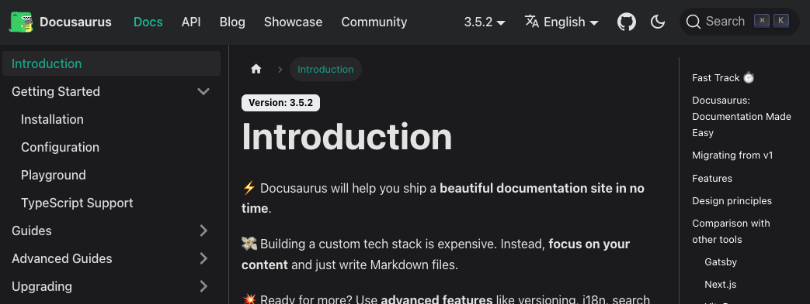
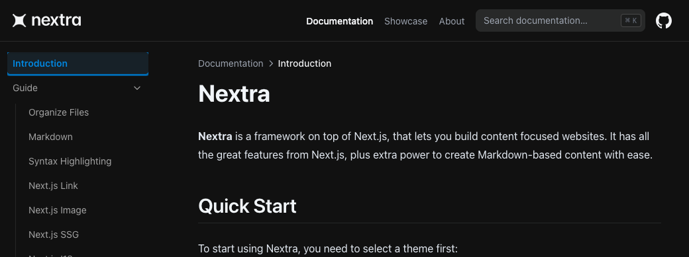
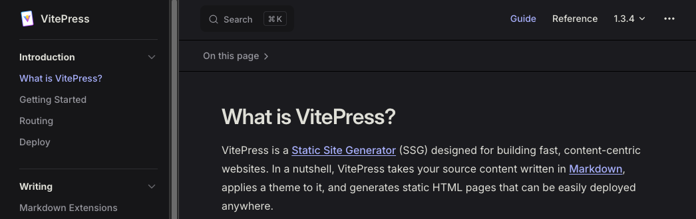
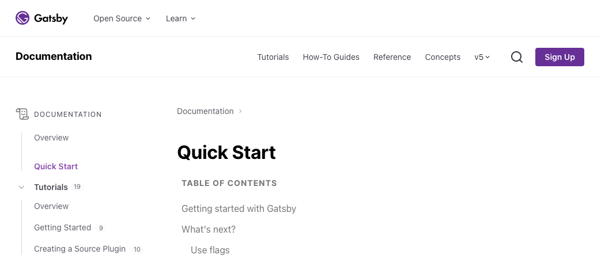

静的サイトジェネレーター（SSG）を使用して開発用ドキュメントを生成、管理することを考えてみます。

比較観点：

- 内部用ドキュメントを想定しているため SEO は考慮しない
- 既存のドキュメントが Markdown ファイルなのでそのまま移植することを想定
- ドキュメント内検索をしたい
- SSG は npm でインストールしたい
- かっこいい（主観）画面が良い

### まとめ表

| SSGツール                            | Markdown対応 | ドキュメント内検索                                                      |
| ------------------------------------ | ------------ | ----------------------------------------------------------------------- |
| [Docusaurus](https://docusaurus.io/) | ○            | デフォルトで利用可能。[Algolia](https://www.algolia.com/)などもサポート |
| [Nextra](https://nextra.site/)       | ○            | デフォルトで利用可能。Next.js ベースなので独自にカスタマイズ可能。      |
| [VitePress](https://vitepress.dev/)  | ○            | デフォルトで利用可能。[Algolia](https://www.algolia.com/)などもサポート |
| [Gatsby](https://www.gatsbyjs.com/)  | ○            | Plugin で利用可能<br>[Algolia](https://www.algolia.com/)などもサポート  |

### 1. [Docusaurus](https://docusaurus.io/)



- Facebook が開発した SSG。ドキュメンテーションに特化しており、React ベースでカスタマイズが容易。

インストール直後のディレクトリ構成：

```sh
README.md
babel.config.js
blog/
docs/
docusaurus.config.ts
node_modules/
package-lock.json
package.json
sidebars.ts
src/
static/
tsconfig.json
```

### 2. [Nextra](https://nextra.site/)

Next.jsベースの SSG で、ドキュメント作成に特化しており、シンプルなセットアップでモダンなドキュメントサイトが構築可能。



ファイル構造：

```sh
# Next.js の追加パッケージのため、ディレクトリ構成は Next.js に従う
.
├─ pages
```

### 3. [VitePress](https://vitepress.dev/)

Vue.jsを使用したドキュメンテーションに特化したSSG。Vueコンポーネントの利用が可能で、拡張性が高い。



ファイル構造：

```sh
.
├─ docs
│  ├─ .vitepress
│  │  └─ config.js
│  ├─ api-examples.md
│  ├─ markdown-examples.md
│  └─ index.md
└─ package.json
```

### 4. [Gatsby](https://www.gatsbyjs.com/)

Reactベースの SSG 。高速かつ高機能なプラグインエコシステムを提供し、動的なサイトの構築にも強い。



インストール直後のディレクトリ構成：

```sh
$ npm init gatsby

README.md
gatsby-config.ts
node_modules/
package-lock.json
package.json
src/
tsconfig.json
```
