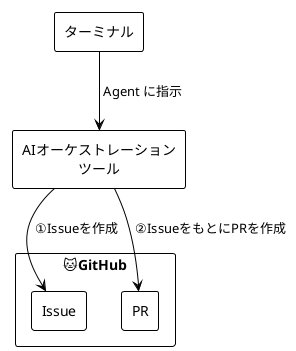

AI で「上司と部下を作ってみて〜」や「プロジェクトマネージャーとエンジニアを作ってみて〜」など、AIエージェントを自作してみる人をよく見かけます。あれが一体どのような仕組みなのか自分でも試してみたくなり、実際に「自律型AIエンジニア」を自作してみました。

## 作ってみたもの

今回構築したAIエージェントの基本的なパイプラインは以下の通りです。

```text
自然言語で指示（人間） → Issue 作成 → コード生成 → Pull Request 作成 → レビュー（人間）
```



人間が「〇〇の機能を追加して」とざっくり指示を出すと、AIが要件を整理してIssue化し、実装を行い、テストが通るまで自己修復を繰り返し、最終的にレビュー待ちのPRを作ってくれる、ツールを構築しました。

詳細なフローは長いので気になる方は以下のシーケンス図を参照してください。

- シーケンス図: https://github.com/takiguchi-yu/cording-pilot/blob/main/docs/agent-sequence-diagram.mmd

## 実装した主な機能と工夫

ただコードを書かせるだけでは ChatGPT や Gemini などでも十分であり、実用性がないため、以下のような機能や工夫を盛り込みました。

- **Fix Loop（テスト駆動の自己修復）の自動化**
  生成したコードをそのまま信じるのではなく、テストやLinterを実行し、エラーが出たらそのログをAIに食わせて修正させるループを構築しました。
- **Multi-Agent による役割分担と文脈管理**
  「計画を立てるAI」「コードを書くAI」「レビューするAI」のように役割を分割し、コンテキストが混ざらないようにしました。
- **コストとレート制限からの解放**
  裏側で何十回もコードを生成するため、ローカルLLM（Ollama等）を活用し、APIの課金や制限を気にせず無限に走らせられる環境を作りました。
- **プロジェクト固有の「知識（Knowledge）」の動的注入**
  一般的な知識だけでなく、設定ファイル経由でそのプロジェクト独自の規約やMarkdownのドキュメントをプロンプトに動的に埋め込む仕組みを導入しました。
- **タスクの細分化（Decomposition）**
  巨大なタスクを一度にやらせるとAIが破綻するため、ひとつの要件を複数の小さなサブタスクに分割し、少ないトークン・小さなコンテキストで処理できるようにしました。

## 作ってみて感じた課題と考慮するべきポイント

アーキテクチャとしては綺麗に組めた（対処できた）部分もありましたが、実際に動かしてみると、オーケストレーションの難しさとLLMの特性による課題に直面しました。

### 1. コストとPCリソースのジレンマ

- **クラウドLLMのコスト**: 賢いモデル（GPT-5.x や Claude 4.x Sonnet など）を使えば精度は出ますが、Fix Loopで何度も呼び出すとAPI料金が跳ね上がります。
- **ローカルLLMの重さと遅さ**: コスト削減のためにローカルLLMに切り替えると、今度はローカルPCのメモリとCPU/GPUが限界まで食いつぶされ、他の作業が何もできなくなります。当然、生成速度（処理速度）もクラウドに比べて圧倒的に遅いです。

### 2. ローカルLLMの「賢さ」の限界

- **精度の低さと日本語の壁**: PCを重くしないために軽量モデルを選ぶと、推論能力が落ちます。特に「複雑な日本語の要件」を理解する力が極端に弱く、指示を誤解して見当違いなコードを書くことが多々ありました。

### 3. Fix-Loop の闇（無限ループ地獄）

テスト駆動の自己修復は理想的ですが、実装は困難を極めました。

- 同じエラーに対して同じ修正を提案し続け、**無限ループにハマる**。
- コードベース全体を把握しているわけではないため、**存在しないライブラリをインポートしようとする**（ハルシネーション）。
- ロジックは合っているのに、LintやFormatの些細なエラーを直すのに膨大な時間を溶かす。

### 4. 実行環境の安全性（サンドボックス化）

AIがシェルコマンドを実行したりファイルを書き換えたりする以上、**ローカルPC上の作業中ファイルを誤って破壊してしまうリスク**が常にありました。ホスト環境から完全に隔離された安全な実行環境（コンテナやNix等）を動的に用意・破棄する仕組みの構築が必須になります。

### 5. プロジェクトの「暗黙知」の壁

エージェントはコードベースの表面しか見えません。そのため、どれだけプロンプトを工夫しても、プロジェクト固有のコンテキストや「ここではこういう書き方をする」という暗黙のルールに反したコードを生成しがちでした。

### 6. 単一モデル運用と多言語対応の限界

- **モデルの適材適所**: Issueの生成（言語能力が必要）と、コードの修正（論理力が必要）を同じモデルに担当させると非常に非効率でした。タスクごとに最適なモデルを切り替えるルーティングが必要です。
- **Polyglot（多言語）化の罠**: 幅広い言語やフレームワークに対応できる「汎用エージェント」を目指すと、プロンプトが抽象的になりすぎて、結果的に生成されるコードの品質が落ちてしまうジレンマがありました。

## まとめ

今回「自立型AIエンジニア」を自作してみた結果、業務を任せるまでには至りませんでした。

「AIエージェントを作る」ということは、単にLLMのAPIを叩くことではなく、**「コンテキストの管理」「タスクの分割」「安全な実行環境の担保」「エラーからの復帰ロジック」という、泥臭いシステムエンジニアリングそのもの**だということが身を以て理解できたからです。

世の中にある優秀なAI開発ツールが、裏側でどれほど高度なオーケストレーションと制約事項のコントロールを行っているのか、その凄みがわかるようになりました。

## おまけ：採用したローカルLLMの構成（2026年5月時点）

ローカルPC（Apple Silicon）をフリーズさせずに、実用的な速度と精度でオーケストレーションを回すため、最終的に以下のモデル構成（ハイブリッド）に落ち着きました。

| エージェント (役割)                   | 採用モデル        | パラメータ数 | 採用理由・特徴                                                                                                                                                                     |
| ------------------------------------- | ----------------- | ------------ | ---------------------------------------------------------------------------------------------------------------------------------------------------------------------------------- |
| **Planner**<br>(要件定義・タスク分割) | `phi4:14b`        | 140億        | Microsoft製の推論特化モデル。70Bクラスの巨大モデルに匹敵する論理パズル・推論能力を持ち、曖昧な指示からでも破綻のないMarkdownの設計書を構築できるため採用。                         |
| **Coder**<br>(コード実装・Fix Loop)   | `deepseek-r1:14b` | 140億        | 回答を出力する前に内部で自問自答（Chain of Thought）を行う最新の推論モデル。「なぜこのコードが動かないのか」を深く思考してから実装差分を出力するため、Fix Loopの迷走が劇的に減る。 |
| **Reviewer**<br>(査読・監督)          | `phi4:14b`        | 140億        | Planner同様、高い推論能力を活用。「JSONスキーマへの厳格な追従」と「エラーログの客観的な根本原因分析」において他を圧倒しており、迷走したCoderを軌道修正する監督役として最適。       |

**【運用上のTips】**
当初は1.5B〜4Bクラスの極小モデルを試しましたが、日本語の理解が崩壊したり、複雑なエラーのFix Loopで無限に迷走したりする限界がありました。
結果として、**16GB以上の統合メモリを持つPCであれば、14Bクラスの4ビット量子化版を動かすのが「賢さと軽さ」のスイートスポット**だと感じています。
（※複数モデルの切り替えでPCが重くなる場合は、Ollamaの起動オプションで `OLLAMA_KEEP_ALIVE=0` を設定し、都度メモリを解放する運用がおすすめです）
